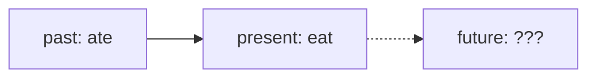
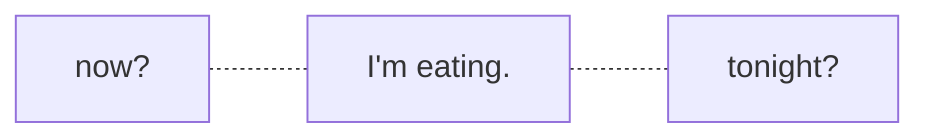
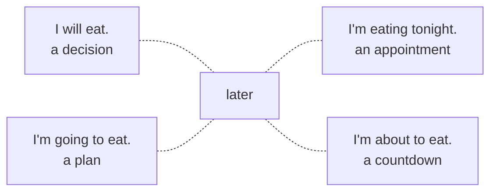

Eat becomes ate when it moves into the past. Ask what it becomes in the future, and you'll be waiting a while.

There isn't one.

An English verb only changes shape for two tenses, present and past. The future never got a shape of its own.

Most textbooks still have a chapter called Future Tense. Open it and you'll find assembly instructions. Take will, add eat, and you get "I will eat."

## Will is present

Will has a past form, the same way can has could. That makes will a present tense verb. In "I will eat", the only word carrying a tense is carrying the present. The future doesn't own a form. It rents one from now.

Will also behaves exactly like can. You can say "I can eat" and "I will eat", but never "I will can eat". They are the same kind of word, and two of them never stack.

And it never fully let go of its old meaning, which was want. "Will you marry me?" isn't a prediction about anyone's future. It's a question about what they want.

Put everything on one grid and the structure shows itself.

|  | simple | progressive | future |
|---|---|---|---|
| present | I eat | I am eating | I will eat |
| past | I ate | I was eating | I would eat |

There are only two rows, because English only has two tenses. The future is a column stacked on top, just like progressive. Some grammarians don't even call the top row present. They call it non-past, a studio apartment that now and later share.

Because the future is only a column, it slides into the past without any resistance. That's where would lives, and would is much harder to read.

| sentence | what it means |
|---|---|
| She said she would eat. | later, seen from back then |
| I would eat if I could. | never |
| Every Sunday we would eat there. | already, many times |
| Would you like to eat? | just manners |

Same word, four different jobs.

## Hearing it, saying it

When you listen, the verb arrives but the time doesn't.

"I'm eating" could be happening right now or later tonight. "He will eat anything" isn't about the future at all. It's about him. So you hunt for words like tonight or tomorrow, and without them, you guess.

Speaking is the same problem in reverse. You already know you mean later. What you don't have is a default way to say it.

Each option carries a little luggage, and none of them means only "later". So you don't really mark the future. You point somewhere near it and let the context finish the job.

Sometimes the future isn't even allowed in. In "I will eat when I get home", getting home clearly happens later, but the verb stays in the present and nobody seems bothered.

So is the English future broken? Not really. People make plans all day and mostly show up.

English just never states the future. It forecasts it.

Tomorrow: cloudy, with a 70% chance of eating.
